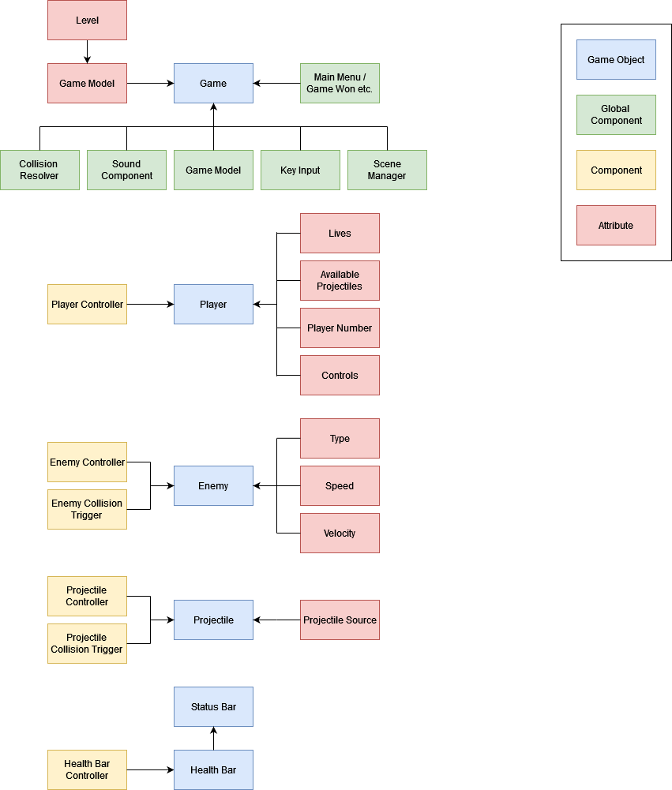

# Starship Carnage
## About

Starship Carnage is a game made as a semestral project for the [NI-APH](https://aphgames.io) course at FIT CTU made using the Colf.io and PIXI.js libraries.

It's a simple space shooter, where your goal is to avoid and destroy all enemy balls that bounce around the walls and off of
each other. When you shoot the enemy it splits into two smaller enemies that are faster and harder to hit.
Shooting the smallest enemy ball destroys it completely.

The game also offers a 1-player and a 2-player mode.

## How to install & run

Prerequisites: Install Node.js
1) Install dependencies with `npm install`
2) Start the sever with `npm run dev`
3) Go to [localhost:1234/index.html](localhost:1234/index.html) to play the game

## Controls

Player controls

| Action      | Player 1 | Player 2 |
|-------------|----------|----------|
| Movement    | W/A/S/D  | ↑/↓/←/→  |
| Shooting    | SPACE    | CTRL     |

In 1-player mode, the player can use controls for either P1 or P2.

## Architecture

## Assets used & credits

The game uses many public domain assets. Here is the complete list of with links.

#### Sounds
* [break.wav](https://freesound.org/people/Swedger/sounds/170635/) (CC0 license)
* [button_change.wav](https://freesound.org/people/SpiceProgram/sounds/387219/) (CC0 license)
* [game_over.wav](https://freesound.org/people/afleetingspeck/sounds/232444/) (CC0 license)
* [game_won.wav](https://freesound.org/people/Eponn/sounds/617763/) (CC0 license)
* [player_hit.wav](https://freesound.org/people/BrickDeveloper171/sounds/610280/) (CC0 license)
* [music_game.wav](https://freesound.org/people/Zetauri/sounds/277251/) by [Zetauri](https://freesound.org/people/Zetauri/) (CC BY license)
* [music_menu.wav](https://freesound.org/people/Zetauri/sounds/326984/) by [Zetauri](https://freesound.org/people/Zetauri/) (CC BY license)
* [shot.wav](https://freesound.org/people/Julien%20Matthey/sounds/268343/) (CC0 license)

#### Sprites
* [Spaceship sprites](https://ansimuz.com/site/art-assets-space-ship-shooter/) (CC0 license)
* heart sprite made by myself using [Piksel](https://www.piskelapp.com/)

#### Font
* [Early GameBoy](https://fontmeme.com/fonts/early-gameboy-font/) (free license)